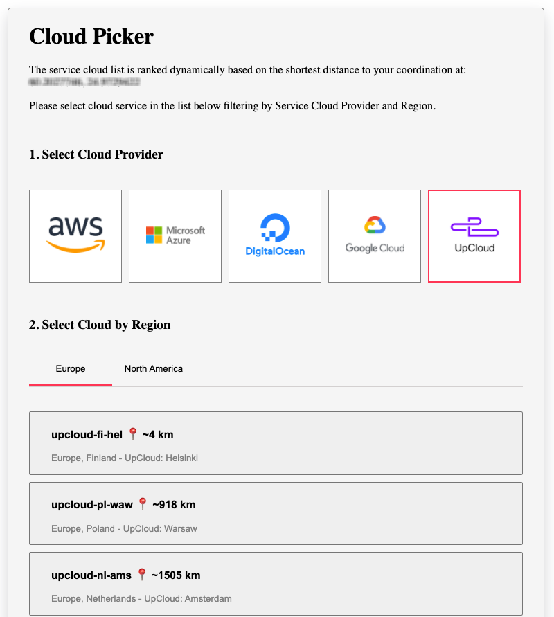

# Cloud Picker
>  A lightweight and easy-to-use cloud picker.

Last updated: 2021

## Usage

When first open, the app loads cloud data and, at the same time, asks the user for geolocation information. Based on these, the app will point the user to the service cloud list where there is a nearest service cloud to the user. The cloud provider and region will therefore be preselected for the user. Users can select options (provider, region, or service cloud) by mouse click or using `tab` to navigate and `enter` to select.

[`Demo`](https://nghilevi.github.io/cloud-picker/)



If user's geolocation can not be obtained (the user do not wish to share their geolocation, or if geolocation is not available on their devices, etc.), [the Prime Meridian (Greenwich) geolocation](https://en.wikipedia.org/wiki/Prime_meridian_(Greenwich)) will be used as default values to calculate the distance.

If cloud data fails to load, an error message will be shown, and the app will not be available to use.

## Running the app

Below are some useful commands:

Getting started and running the app locally
```bash
npm install
npm start
```
Run unit testing

```bash
npm test
```

Run test with coverage report
```bash
npm run cov
```

Analyze code bundle
```bash
npm run build
npm run analyze
```

## App structure

`src`
contains all the needed source code.  

`components`
contains all components that serve as building blocks for `CloudPicker` and the whole app.

`utils`
contains all the common logic that is shared between `components` and `hooks`. 

`hooks`
contains all custom React hooks whose logic can also be used by multiple components. This modularity helps improve reusability and testability, which also leads to overall enhanced maintainability and scalability of the app.

### other files

`src/App.tsx`: the entry of the app. It is a wrapper component for `CloudPicker`, and also feed data to `
`CloudPicker`.

`_var.scss`
contains shared variables and other scss files named the same or colocate with the component that they support.

`ErrorBoundary.tsx`
React components that catch JavaScript errors anywhere in their child component tree, log those errors, and display a fallback UI instead of the component tree that crashed. Read more about this [here](https://reactjs.org/docs/error-boundaries.html).
## App flow

### 1/ Fetching data
As mentioned earlier in **Usage** section, the app starts two things in parallel when it is opened: 
- fetch cloud data 
- fetch user geolocation (which may require user permission) 

The cloud data may be loaded before geolocation is obtained. If loaded data is shown first and geolocation is obtained later, the app will need to re-render the UI to reflect the distance.
To avoid this, in the current implementation, cloud data is only shown after geolocation is resolved. 

Note that, it does not matter if geolocation can be obtained or not, as long as cloud data is loaded successfully from Aiven server, the app will be usable (user can interact and select the cloud) since Greenwhich geolocation is used as the fallback value for user geolocation. (The use of Greenwhich geolocation is optional, we can just simply skip calculating the distance as well as sorting ops. This is for illustration purposes only)

### 2/ Transforming data
When both cloud data and geolocation are resolved, the data transformation process kicks in. It transforms 'raw' cloud data fetched from the server to a format/structure that the app can easily use. All the logic of this process is implemented in custom hooks and `utils/transform` module.

In the `test/mock.tsx`, you will find an example of what original fetched vs transformed data looks like.

The idea is UI components only needs to focus on presenting the data without doing any transforming, filtering, or calculation on every user interaction which not only brings benefits in terms of low latency, enhanced responsiveness, and UX, but also in terms of "separation of concerns"  - the UI only do its job of presentation.

## Performance notes

The transform module does the heavy lifting of transforming a list of clouds data fetched from the backend to a "table" (Javascript object) that is consumed by the UI components. 

It does so by first mapping each fetched list item to a new JS object with new/additional properties such as `distance`, which is calculated using [haversine formula](https://en.wikipedia.org/wiki/Haversine_formula) and user geolocation. 

It then sorts the mapped list based on `distance` so the items with the smallest distances are ranked first.

It then reduces the mapped list into a single object where each property/key is a cloud provider name (such as "Azure" or "Google Cloud") and the key's corresponding value is another object whose properties are regions such as "Asia", "Europe" etc.

Overall, these 3 steps may require looping through the list 3 times. While looping through N items costs `O(N)`, sorting may cost `O(NlogN)`. So in general the complexity to run these can be considered as `O(NlogN)`, which is still acceptable.

Finally, it loops through the reduced object to do some "cleaning" by removing redundant items such as empty array as well as adding newly aggregated data such as a list of alphabetically sorted providers/regions by cloud provider. This process takes minimal cost since we don't have to loop through every original list item again, and the number of cloud providers and regions is very limited.

Later, when user interacts with the filter options, the app no longer needs to do any real filtering logic behind the scene. All it does is retrieve the data from the transformed object, which only costs `O(1)` complexity.

### Other approaches

If the list of clouds is huge, say more than 10k service clouds, or if it takes time to transform the data, we can also come up with better approaches to avoid sorting all data at once, which may cause blocking in the UI.

One way is, in the first iteration through the cloud list (i.e mapping), we can already figure out which service cloud from each region and provider is the closest ones to the user. Based on that we know what to show to the user from the start. If the user navigates to other filtering options, we can do sorting accordingly, only for that category, and also save the sorted result in the memory. In other words, instead of a big bang sorting in the beginning, we sort (and save the sorted result) on demand.

## Future improvements notes

Below are possible improvements:
- Responsive design
- Add more and better tests especially to handle unhappy cases, crashes, etc. e.g corrupted response data
- Add E2E tests e.g for selection flow, running against different real browsers
- In reality, user geolocation may not be shown as well as many UX concerns should be solved.
- May be apply some good practices and patterns here and there e.g using Error Boundaries more etc.
- Performance can also be improved even more to enhance responsiveness in case of huge data (as mentioned earlier in *Performance notes* section)

## Some other notes

The app is lightweight. At the time of this writing, it is only 136,3 KB.
Bundle size is important particularly for users on low bandwidth connections.

All attributions are commented in the code.

Coverage reports can be found under coverage folder.

Github Actions is used for CI. See the `.github` folder.

